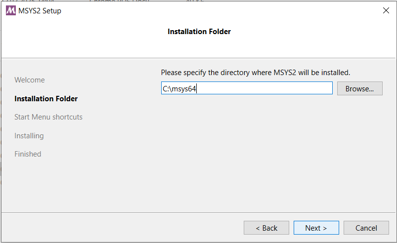
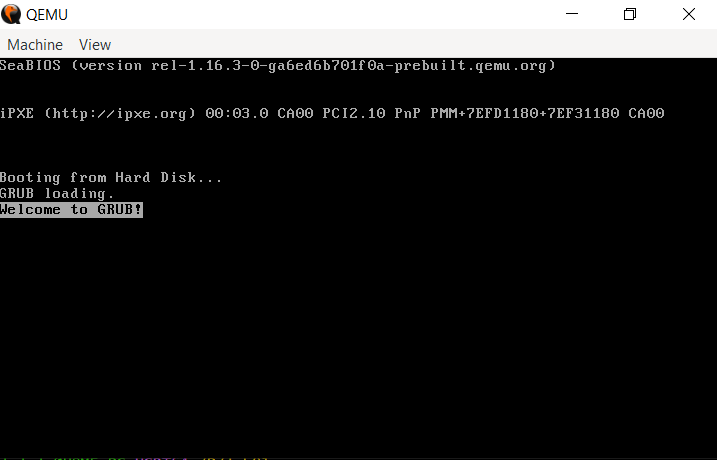
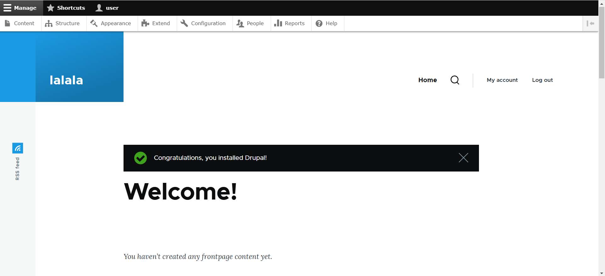

# Лабораторная работа №1. Виртуальный сервер

## Студент: Mihailov Piotr, группа I2302

- **Дата выполнения: 16.02.2025**

## Описание и постановка задачи

Данная лабораторная работа знакомит с виртуализацией операционных систем и настройкой виртуального HTTP сервера на базе QEMU и Debian. В ходе работы необходимо:

- Установить виртуальную машину с Debian.
- Настроить веб-сервер LAMP.
- Установка Apache, MariaDB, PHP.
- Установить и настроить PhpMyAdmin и CMS Drupal.
- Настроить виртуальные хосты.
- Проверить работу сервисов.

### Ход работы

### 1. Установка необходимых компонентом

1. Для начала, я устанавливаю MSYS2.

2. После установки MSYS2,создаю папку `lab01`, в ней создается:
   - Папка `dvd` для ISO-образа.
   - Файл `readme.md`.
3. Захожу на официальный сайт и копирую ссылку для дальйнешей работы.

4. Прописываю следующую команду в командную строку, для скачивания образа.

```sh
wget -O debian.iso https://cdimage.debian.org/debian-cd/current/amd64/iso-dvd/debian-12.9.0-amd64-DVD-1.iso
```


5. После я устанавливаю QEMU, используя следующую команду:

```sh
pacman -S mingw-w64-ucrt-x86_64-qemu
```


6. QEMU был успешно установлен.

## 2. Установка ОС

Для начала установки ОС, я прописываю следующую команду, для создания образа диска для виртуальной машины, формат qcow2.

```sh
qemu-img create -f qcow2 debian.qcow2 8G
```

Запускаю установку ОС с помощью команды и начинаю установку

```sh
qemu-system-x86_64 -hda debian.qcow2 -cdrom dvd/debian.iso -boot d -m 2G
```


При установке я использовал параметры:

- Имя компьютера: `debian`
- Хостовое имя: `debian.localhost`
- Имя пользователя: `user`
- Пароль: `password`

После установки перезагрузил виртуальную машину

   ```bash
   qemu-system-x86_64 -hda debian.qcow2 -m 2G -smp 2 \
       -device e1000,netdev=net0 -netdev user,id=net0,hostfwd=tcp::1080-:80,hostfwd=tcp::1022-:22
   ```

   

---

## 3. Установка LAMP

Для дальнейшей работы я переключаюсь на суперпользователя, используя следующую команду:

   ```bash
   su
   ```

Устанавливаю необходимые пакеты:

   ```bash
   apt update -y
   apt install -y apache2 php libapache2-mod-php php-mysql mariadb-server mariadb-client unzip
   ```


## 4. Установка PhpMyAdmin и Drupal

1. Скачал файлы:

   ```bash
   wget https://files.phpmyadmin.net/phpMyAdmin/5.2.2/phpMyAdmin-5.2.2-all-languages.zip
   ```

   

   ```bash
   wget https://ftp.drupal.org/files/projects/drupal-10.0.5.zip
   ```

   

   Проверяю на их наличие командой `ls -l`
   

2. Размещяю и распаковываю файлы:

   ```bash
   mkdir /var/www
   unzip phpMyAdmin-5.2.2-all-languages.zip
   mv phpMyAdmin-5.2.2-all-languages /var/www/phpmyadmin
   unzip drupal-10.0.5.zip
   mv drupal-10.0.5 /var/www/drupal
   ```

---

## 5. Настройка базы данных

Для дальнейшей работы необходимо создать базу данных, ввожу следующие команды для этого:

```bash
mysql -u root
CREATE DATABASE drupal_db;
CREATE USER 'piotr'@'localhost' IDENTIFIED BY 'password';
GRANT ALL PRIVILEGES ON drupal_db.* TO 'piotr'@'localhost';
FLUSH PRIVILEGES;
EXIT;
```

---

## 6. Настройка виртуальных хостов

Создаю файл командой:

```sh
nano /etc/apache2/sites-available/01-phpmyadmin.conf
```

и далее ввожу следующее содержимое:

```sh
<VirtualHost *:80>
    ServerAdmin webmaster@localhost
    DocumentRoot "/var/www/phpmyadmin"
    ServerName phpmyadmin.localhost
    ServerAlias <www.phpmyadmin.localhost>
    ErrorLog "/var/log/apache2/phpmyadmin.localhost-error.log"
    CustomLog "/var/log/apache2/phpmyadmin.localhost-access.log" common
</VirtualHost>
```

Также создаю следующий файл командой:

```sh
nano /etc/apache2/sites-available/02-drupal.conf
```

и далее ввожу следующее содержимое:

```sh
<VirtualHost *:80>
    ServerAdmin webmaster@localhost
    DocumentRoot "/var/www/drupal"
    ServerName drupal.localhost
    ServerAlias <www.drupal.localhost>
    ErrorLog "/var/log/apache2/drupal.localhost-error.log"
    CustomLog "/var/log/apache2/drupal.localhost-access.log" common
</VirtualHost>
```

Далее я зарегистрировал конфигурацию, выполнив команды:

```bash
/usr/sbin/a2ensite 01-phpmyadmin
/usr/sbin/a2ensite 02-drupal
```

Выполняю перезагрузку Apache HTTP Server командой:
`systemctl reload apache2`


Далее я в файл `/etc/host` добавил следующие строки

```bash
127.0.0.1 phpmyadmin.localhost
127.0.0.1 drupal.localhost
```


---

## 7. Тестирование

1. В открывшемся консольном окне выполните команду uname -a.

   ```bash
   uname -a
   ```

   

2. Перезагрузка Apache Web Server

   ```bash
   systemctl restart apache2
   ```

3. Проверил сайты в браузере:
   - <http://drupal.localhost:1080>
   
   - <http://phpmyadmin.localhost:1080>
   

4. При дальнейших настройках и установках, я встретился со следующими ошибками


Для решения ошибки с `PHP extensions`, я выполнил следующие команды

```bash
apt update
apt install php-gd php-xml
systemctl reload apache2
```

Для решения ошибки с "File System и Settings file", я прописал следующие команды:

Как видим, все ошибки пропали и мы можем продолжить установку

5. После выполнения всех манипуляций, мы завершаем установку.


## 8. Ответы на вопросы

1. **Каким образом можно скачать файл в консоли при помощи утилиты wget?**

   ```bash
   wget <URL>
   ```

2. **Зачем необходимо создавать для каждого сайта свою базу и своего пользователя?**
   - Создание отдельной базы данных и пользователя для каждого сайта необходимо для повышения безопасности,
    предотвращая доступ одного приложения к данным другого. Это также упрощает администрирование,
     так как каждому пользователю можно задать индивидуальные права доступа.
      Кроме того, раздельные базы данных снижают риск конфликтов данных между разными приложениями, улучшая стабильность работы сервера.
3. **Как поменять доступ к системе управления БД на порт 1234?**
   - В файле `/etc/mysql/mariadb.conf.d/50-server.cnf` изменить `port = 1234`, затем перезапустить MySQL.
4. **Какие преимущества, с вашей точки зрения, даёт виртуализация?**
   - Виртуализация даёт множество преимуществ, включая изоляцию, благодаря которой каждая виртуальная машина работает независимо от других,
    а также экономию ресурсов, позволяя запускать несколько серверов на одном физическом устройстве. Она обеспечивает гибкость, позволяя легко создавать,
     клонировать и восстанавливать виртуальные машины, а также предоставляет безопасную среду для тестирования без риска повредить основной сервер.
5. **Для чего необходимо устанавливать время / временную зону на сервере?**
   - Настройка правильного времени и временной зоны на сервере важна для корректной работы журналов логов, синхронизации времени между сервером и клиентами,
    выполнения задач по расписанию, а также для работы сертификатов SSL и других систем безопасности.
   Несовпадение времени может привести к ошибкам в работе сервисов, некорректной записи логов и сбоям в системе аутентификации.
6. **Сколько места занимает установленная вами ОС (виртуальный диск) на хостовой машине?**
Моя система весит 3,3gb. Для того,чтобы опрелелить сколько занимает ОС, необходимо выполнить следующую команду

   ```bash
   du -sh debian.qcow2
   ```

7. **Какие есть рекомендации по разбиению диска для серверов? Почему рекомендуется так разбивать диск?**

- /boot (512 МБ – 1 ГБ) – хранит загрузочные файлы, изолируя их от основной системы.
- swap (равен или больше ОЗУ) – используется как виртуальная память, что важно при нехватке оперативной памяти.
- /var (10–20 ГБ) – хранит логи, кеш и базы данных, чтобы их рост не заполнял основной раздел.
- /tmp (1–5 ГБ) – выделяется для временных файлов, чтобы избежать их влияния на систему.
- /home (размер зависит от использования) – хранит пользовательские данные, что упрощает резервное копирование.
- / (оставшееся пространство) – корневой раздел, содержащий основную систему.
Такое разбиение повышает безопасность (сбой в одном разделе не затрагивает другие), улучшает производительность (уменьшается фрагментация) и даёт гибкость (можно отдельно управлять разными частями системы).

## 9. Выводы

В ходе лабораторной работы была освоена установка и настройка виртуальной машины с Debian, установка стека LAMP, работа с базами данных, настройка виртуальных хостов и тестирование работы серверов.
